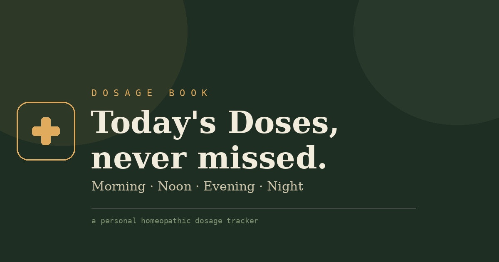

# Dosage Book

A single-file, mobile-friendly medicine tracker for a homeopathic dosage schedule — built around three tabs: **Today**, **History**, and **Settings**. No backend, no build step, no dependencies. It's one `index.html` file that runs entirely in the browser.



## Features

- **Today** — every medicine grouped by time of day (Morning / Noon / Evening / Night), plus a pinned "before every meal" card for constant doses. Tap the amber seal to mark a dose taken.
- **Alternate-day & interval dosing** — medicines like "every alternate morning" or "every 10 days" only appear as due on their actual due day; otherwise they show a faded "next in X days" note.
- **History** — course progress bar, a per-medicine taken/expected/left breakdown, a full daily log, and a **Missed doses** card that flags anything due but never ticked on the most recent past day.
- **Export / Import** — download all data as a `.json` backup and load it on another device or browser to keep everything in sync.
- **CSV export** — full dosage log as a spreadsheet-ready CSV.
- **Light / dark theme** toggle, saved on-device.
- **Data storage** — everything is saved in the browser's `localStorage`. Nothing is sent to any server.

## File structure

```
├── index.html      the entire app (HTML + CSS + JS, single file)
├── favicon.png      app icon
├── og-image.png     social link-preview image
└── README.md
```

## Running it

No install, no build. Just open `index.html` in a browser.

**Important:** run it as an actual page (a real file:// tab, or hosted online) rather than inside an embedded preview/iframe — `localStorage` and link previews both need a real browser context to work.

## Hosting it (so link previews & the favicon work)

Any static host works. Two easy free options:

**GitHub Pages**
1. Push this repo to GitHub.
2. Go to **Settings → Pages**, set source to your default branch, root folder.
3. Your site will be live at `https://<username>.github.io/<repo>/`.

**Netlify Drop**
1. Go to [netlify.com/drop](https://app.netlify.com/drop).
2. Drag this folder in. You'll get a live URL instantly.

## Customizing the schedule

All medicines, dose slots, and interval rules live near the top of the `<script>` block in `index.html`, inside `DOSE_META` and `MEDICINES`. Anchor dates for alternate-day/interval medicines (`LYCOPODIUM_ANCHOR`, `AMMON_CARB_ANCHOR`) and the overall course window (`COURSE_START`, `COURSE_END`) are defined as constants right above them — update these if the prescription changes.

## Data & privacy

All dosage data lives only in your browser's local storage on the device you're using — it isn't uploaded anywhere. Use the **Export** button in Settings regularly to back it up, and **Import** on any other device you want the same history on.

## License

Personal project — use and adapt freely.
